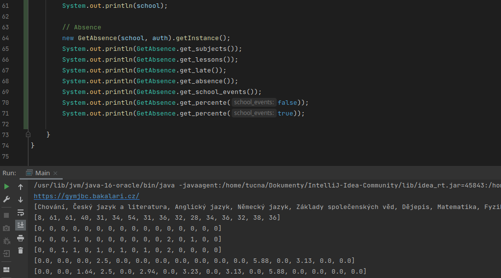

# BAKALÁŘI - JAVA API

Java API pro _BAKALÁŘE_ vytvořeno v _Java 16_ za pomoci [bakalari-api](https://github.com/bakalari-api/bakalari-api-v3).

Cílem _bylo, je_ a _bude_ usnadnit přístup k Bakalářům v Javě, abyste se mohli plně soustředit na vývoj vlastní aplikace, která stávající Bakaláře nahradí.

| Verze | Odkaz na `.jar` |
| --- | --- |
| 0.0.4 | [balalari-0.0.4.jar](https://github.com/tucnakomet1/Bakalari-API/releases/download/0.0.4/bakalari-0.0.4.jar)

## Odkazy na bližší dokumentaci
- [Core](src/com/company/core/README.md)
  - [Města](src/com/company/core/README.md#mesta)
  - [Školy](src/com/company/core/README.md#skoly)
  - [Přihlášení](src/com/company/core/README.md#prihlaseni)
- [Absence](src/com/company/absence/README.md)
- [Pololetí](src/com/company/pololeti/README.md)
- [Známky](src/com/company/marks/README.md)

## Todo

- [x] Absence
- [ ] Domácí úkoly
- [ ] Komens
- [x] Pololetí
- [x] Přihlášení
- [ ] Rozvrh hodin
- [x] Seznam měst
- [x] Seznam škol
- [x] Známky

## Screenshoty

---

*Poslední aktualizace proběhla 23.12.2021*